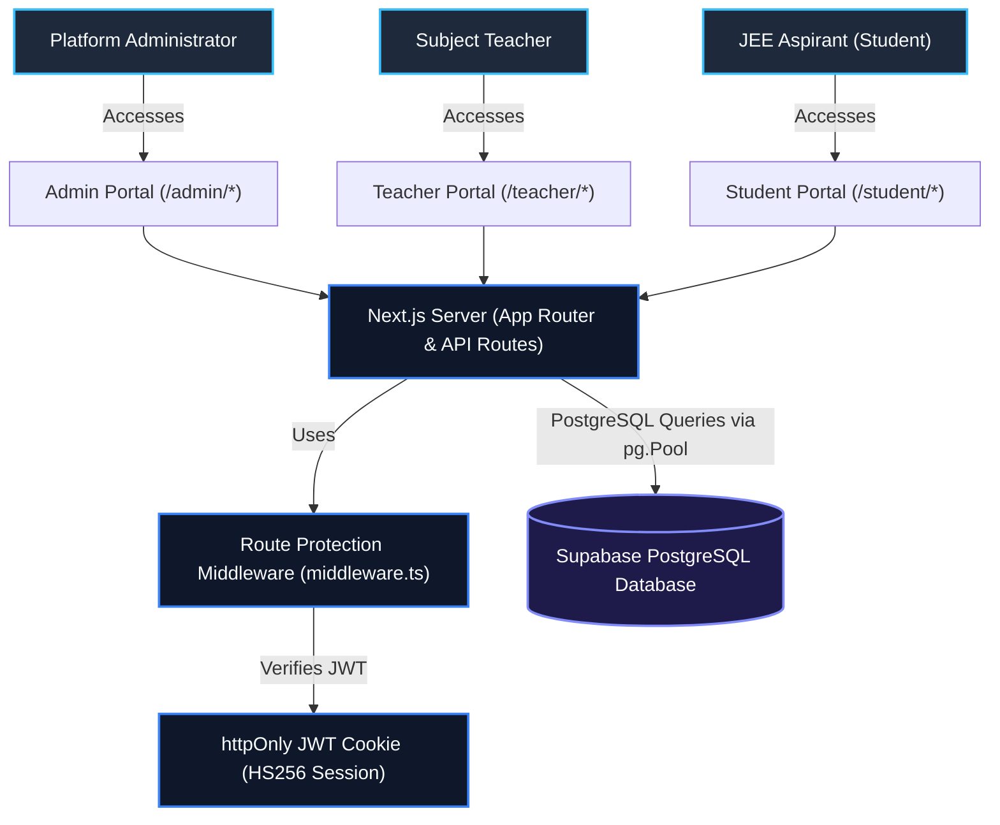
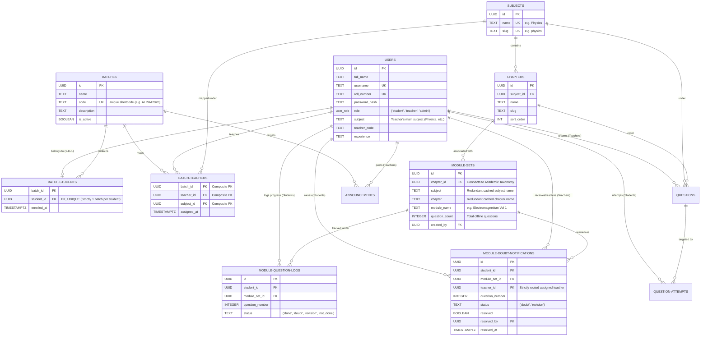
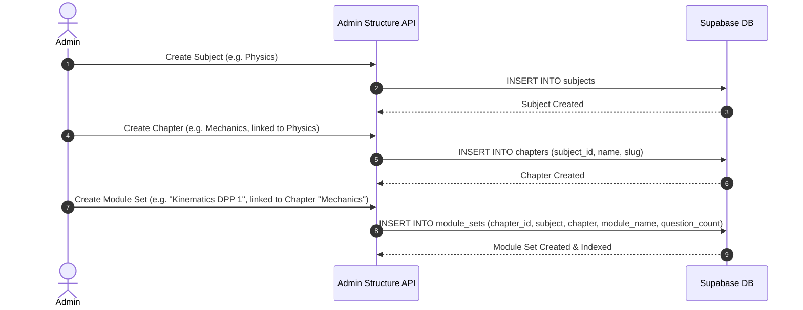
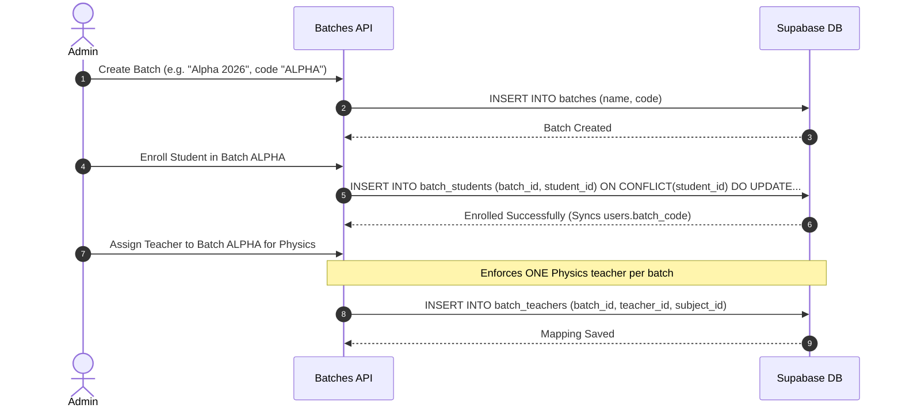
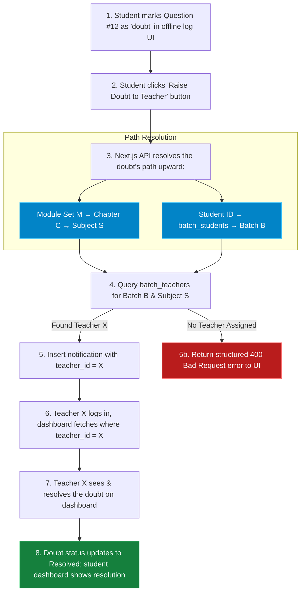
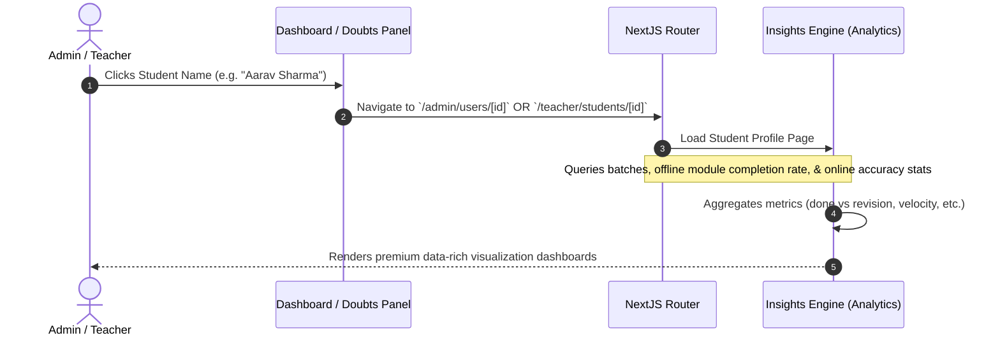
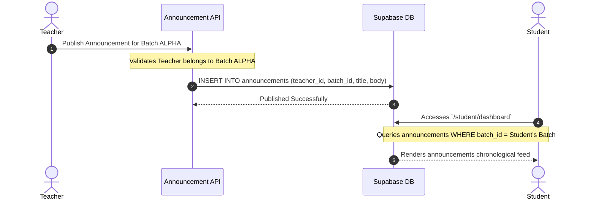

# JEE Tracker Application Workflow & System Architecture

This document provides a comprehensive overview of the JEE Tracker application's architecture, data schema, user workflows, and structural relationships. It is designed to help developers, teachers, and administrators understand how various parts of the platform are connected and how data flows through the system.

---

## 1. High-Level System Architecture

The JEE Tracker is built on a modern full-stack web architecture utilizing **Next.js (App Router)** as both the frontend UI and the backend API server, powered by a **Supabase PostgreSQL** database.



### Key Architectural Pillars:
* **Custom JWT-based Authentication**: Instead of Supabase Auth, the system uses custom authentication. Passwords are encrypted with `bcrypt` (12 rounds), and sessions are managed using encrypted `HS256 JWT` payloads stored in secure `httpOnly` client cookies.
* **Role-Based Routing (Middleware)**: Intercepts all requests under `/admin`, `/teacher`, and `/student` to ensure the session contains the valid role.
* **Consolidated Academic Model**: A strictly relational structure in PostgreSQL that scales dynamically with index-backed optimizations.

---

## 2. Database Schema & Entity Relationships

The core database consists of three functional groups: **Users & Batches**, **Academic Taxonomy**, and **Logging & Practice Engines**.



### Relational Constraints Enforced:
1. **One-Student-One-Batch**: Enforced by a `UNIQUE (student_id)` constraint on `batch_students`.
2. **Dedicated Batch Teachers**: The `batch_teachers` table has a `UNIQUE (batch_id, subject_id)` constraint. This ensures a batch has exactly one teacher assigned for Physics, one for Chemistry, and one for Mathematics.
3. **No Duplicate Question Logs**: Enforced by `UNIQUE (student_id, module_set_id, question_number)` on `module_question_logs` to enable clean atomic upserts.

---

## 3. Core Workflows

### A. Academic Setup Workflow (Admin)
Administrators define the structure of the JEE curriculum. This structure is consumed by teachers (to create questions) and students (to explorer and log progress).



---

### B. Batch Enrolment & Teacher Mapping (Admin)
Admins configure coaching classrooms by enrolling students in batches and mapping dedicated teachers to specific subjects in those batches.



---

### C. Offline Module Logging & Doubt Routing Workflow
This is the core learning loop of the application. Students solve physical textbook coaching modules offline, log their progress, and raise doubts that route directly to their assigned teacher.



#### Detailed Doubt Routing Query Logic:
When a doubt is raised, the system executes this precise routing logic:
```sql
SELECT bt.teacher_id, u.role
FROM module_sets ms
JOIN chapters c ON c.id = ms.chapter_id
JOIN batch_students bs ON bs.student_id = $1 -- Student ID
JOIN batch_teachers bt ON bt.batch_id = bs.batch_id AND bt.subject_id = c.subject_id
JOIN users u ON u.id = bt.teacher_id
WHERE ms.id = $2 -- Module Set ID
LIMIT 1;
```
1. This query ensures that a notification is **never** globally broadcasted to all teachers.
2. It guarantees the doubt goes to the teacher responsible for that subject *in that student's specific batch*.
3. If no teacher is assigned for that subject in the student's batch, the API throws a graceful user-facing `400` error asking the Admin to verify batch teacher assignments, preventing silent database exceptions.

---

### D. Interactive Student Progress Insights Workflow
Admin and Teacher portals feature full visibility into student progress. Clicking a student's name anywhere immediately launches their interactive academic profile.



---

### E. Teacher Announcements & Student Feeds
Teachers can broadcast notifications, updates, or assignments directly to their batches.



---

## 4. Summary of System Portals & Navigation Routes

Here is a quick reference table of routes within the application:

| User Role | Page / Endpoint | Purpose |
| :--- | :--- | :--- |
| **Common** | `/signup` | Student-only registration page (Admin registers teachers/admins). |
| **Common** | `/login/student`, `/login/teacher`, `/login/admin` | Custom secure login gateways. |
| **Admin** | `/admin/dashboard` | Main admin overview (Total batches, system activity stats). |
| **Admin** | `/admin/batches` | Create batches, enroll students, and assign subject teachers. |
| **Admin** | `/admin/structure` | Manage the primary subject taxonomy and chapter ordering. |
| **Admin** | `/admin/modules` | Set up offline modules and DPP question counts. |
| **Admin** | `/admin/users` | Lists all platform users with deep-dive insight profile links. |
| **Teacher** | `/teacher/dashboard` | Batch statistics overview and pending doubts feed. |
| **Teacher** | `/teacher/module-doubts` | Doubt notification center strictly showing routed questions. |
| **Teacher** | `/teacher/students` | Detailed progress insight rosters for assigned batch students. |
| **Teacher** | `/teacher/questions` | Online practice engine question bank and editor. |
| **Student** | `/student/dashboard` | Announcement feed, subject shortcuts, and overall logging progress. |
| **Student** | `/student/module-log` | Log offline coaching module question status and raise teacher doubts. |
| **Student** | `/student/explorer` | Track and initiate practice sessions for online questions by category. |
| **Student** | `/student/practice` | Question practice screen featuring immediate correct/wrong validation. |
| **Student** | `/student/mistakes` | Targeted practice engine filter for question attempts marked as mistakes. |
